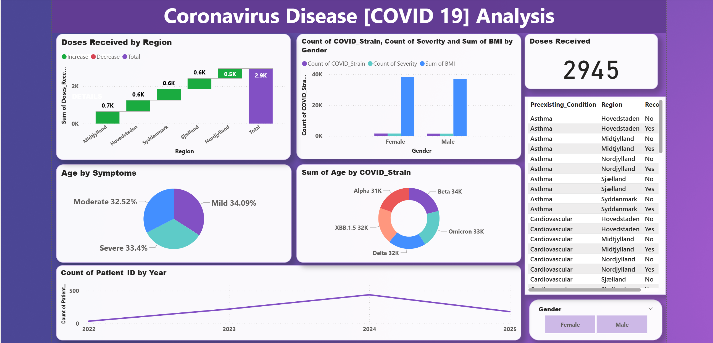

## 📊 COVID-19 Analysis Dashboard
The COVID-19 Analysis Dashboard is an interactive Power BI project that visualizes key insights on COVID-19 cases, vaccinations, symptom severity, demographics, and virus strains. Using DAX measures, it transforms raw data into actionable insights to support healthcare decision-making and policy analysis.

## 📌 Project Overview
- This project presents an interactive COVID-19 Analysis Dashboard built with Power BI.
- The dashboard provides key insights into the pandemic’s impact, focusing on cases, symptoms, vaccinations, demographics, and comorbidities.
- It is designed for healthcare analysts, policymakers, and researchers who need quick, data-driven insights on the spread and severity of COVID-19.

## 🚀 Features
- Doses Received by Region – Visualizes vaccination trends across different regions.
- Cases by Gender – Breakdown of COVID strain, severity, and BMI distribution across male and female populations.
- Age by Symptoms – Percentage distribution of symptoms (Mild, Moderate, Severe) across patients.
- COVID Strains Impact – Age distribution across different strains (Alpha, Beta, Delta, Omicron, XBB).
- Yearly Patient Trends – Number of patients tracked by year from 2022–2025.
- Preexisting Conditions – Table highlighting the impact of comorbidities (e.g., Asthma, Cardiovascular diseases) across regions.
- KPI Card – Quick indicator showing total doses received.

## 🛠️ Tech Stack
- Power BI – Data modeling, measures (DAX), and visualization
- DAX (Data Analysis Expressions) – For calculated measures such as totals, percentages, and cumulative counts
- Excel/CSV (assumed) – Source datasets

## Dataset Used

## 📂 Repository Structure
├── data/                # Raw and cleaned COVID-19 datasets
├── dashboard/           # Power BI report files (.pbix)
├── images/              # Screenshots of the dashboard
├── README.md            # Project documentation

## 📊 Key DAX Measures
Examples of DAX measures used in the report:
- Total Doses Received
Total Doses = SUM('CovidData'[Doses])

- Total Cases
Total Cases = SUM('CovidData'[Cases])

- Cumulative Cases
Cumulative Cases =
CALCULATE (
    SUM ( 'CovidData'[Cases] ),
    FILTER (
        ALL ( 'CovidData'[Date] ),
        'CovidData'[Date] <= MAX ( 'CovidData'[Date] )
    )
)

## 📸 Dashboard 

## 📈 Insights Derived
- Vaccination progress varies by region, with Midtjylland and Hovedstaden leading.
- Males and females show similar strain distribution, but BMI levels differ.
- Severe symptoms account for ~33% of cases, highlighting healthcare risks.
- New strains (e.g., XBB) continue to emerge, but age distribution is consistent with earlier strains.
- Cases peaked in 2024, followed by a decline in 2025.

## ⚠️ Challenges Faced
- Data Quality Issues – Missing values and inconsistent reporting across regions required cleaning and preprocessing.
- Dynamic Calculations – Implementing cumulative cases and percentage distributions using DAX measures was complex.
- Visualization Choices – Selecting the right chart types to balance clarity and detail without overwhelming the dashboard.
- Performance Optimization – Ensuring the dashboard loads quickly despite large datasets.

## ✅ Conclusion
- This Power BI dashboard provides a comprehensive view of COVID-19 trends, covering vaccinations, patient demographics, symptom severity, and strain evolution.
- It highlights the importance of data-driven decision making in public health and demonstrates how Power BI + DAX can transform raw datasets into actionable insights.
- The solution can be easily extended for real-time updates and adapted for future healthcare analytics use cases.
